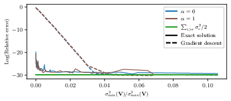
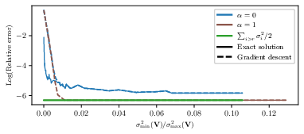
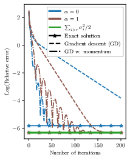
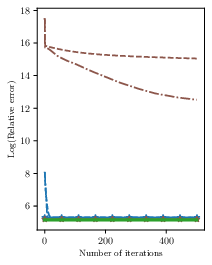
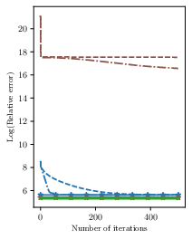
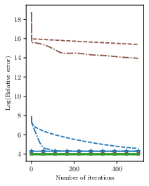

# In-depth Analysis of Low-rank Matrix Factorisation in a Federated Setting
We present here the code of the experimental parts of the following paper:
```
Constantin Philippenko, Kevin Scaman and Laurent Massoulié, In-depth Analysis of Low-rank Matrix Factorisation in a Federated 
Setting , 2024.
```

In this paper, we analyze a distributed algorithm to compute a low-rank matrix factorization on $N$ clients, each 
holding a local dataset $\mathbf{S}^i \in \mathbb{R}^{n_i \times d}$, mathematically, we seek to solve 
$min_{\mathbf{U}^i \in \mathbb{R}^{n_i\times r}, \mathbf{V}\in \mathbb{R}^{d \times r} } \frac{1}{2} \sum_{i=1}^N \|\mathbf{S}^i - \mathbf{U}^i \mathbf{V}^\top\|^2_{\text{F}}$. 
Considering a power initialization of $\mathbf{V}$, we rewrite the previous smooth non-convex problem into a smooth 
strongly-convex problem that we solve using a parallel nesterov gradient descent potentially requiring a single step of 
communication at the initialization step. For any client $i$ in $\{1, \dots, N\}$, we obtain a global $\mathbf{V}$ in 
$\mathbb{R}^{d \times r}$ common to all clients and a local variable $\mathbf{U}^i$ in $\mathbb{R}^{n_i \times r}$. We 
provide a linear rate of convergence of the excess loss which depends on $\kappa^{-1}(\mathbf{S})$, where $\mathbf{S}$ 
is the concatenation of the matrix $(\mathbf{S}^i)_{i=1}^N$ and $\kappa(\mathbf{S})$ its condition number. This result 
improves the rates of convergence given in the literature, which depend on $\kappa^{-2}(\mathbf{S})$. We provide an 
upper bound on the Frobenius-norm error of reconstruction under the power initialization strategy. We complete our 
analysis with experiments on both synthetic and real data.


From our analysis, several take-aways can be identified.
1. Increasing the number of communication $\alpha$ leads to reduce the error $\epsilon$ by a factor 
$\sigma_{r_\*+1}^{4\alpha}/ \sigma_{r_\*}^{4\alpha}$, therefore, getting closer to the minimal Frobenius-norm error 
$\epsilon$.
2. Using a gradient descent instead of an SVD to approximate the exact solution of the strongly-convex problem allows us 
to bridge two parallel lines of research. Further, we obtain a simple and elegant proof of convergence and all the 
theory from optimization can be plugged in.
3. By sampling several Gaussian matrix $\Phi$, we improve the rate of convergence of the gradient descent. Further, 
based on random Gaussian matrix theory, it results in an almost surely convergence if we sample $\Phi$ until 
$\mathbf{V}$ is well conditioned.

## Running experiments

Run the following commands to generate the illustrative figures in the article.

### Figure 3

Condition number on the X-axis, the logarithm of the loss F after 1000 local iterations on the Y-axis.

Goal: illustrate the impact of the sampled Gaussian matrices Phi on the convergence rate.


**Left**: without noise. **Right**: with noise.

<p float="left">
  
  
</p>

```python3 -m src.plotter_script.PlotErrorVSCond```

### Figure 4

Iteration index on the X-axis, the logarithm of the loss F after 1000 local iterations on the Y-axis.

Goal: illustrate on real-life datasets how the algorithm behaves in practice.


**Left to right**: (a) synthethic dataset, (b) w8a, (c) mnist and (d) celeba.

<p float="left">
  
  
  
  
</p>


```python3 -m src.plotter_script.PlotRealDatasets --dataset_name synth```

```python3 -m src.plotter_script.PlotRealDatasets --dataset_name mnist```

```python3 -m src.plotter_script.PlotRealDatasets --dataset_name celeba```

```python3 -m src.plotter_script.PlotRealDatasets --dataset_name w8a```

### Used dataset.

We use three real datasets: mnist, celeba and w8a that should be stored at this location ```~/GITHUB/DATASETS```.

Mnist is automatically downloaded if it not present. The user should download w8a 
[here](https://www.csie.ntu.edu.tw/~cjlin/libsvmtools/datasets/binary/w8a) and celeba 
[from Kaggle](https://www.kaggle.com/datasets/jessicali9530/celeba-dataset) 


## Requirements

Using pip:
```pip install -c conda-forge -r requirements.txt python=3.7```. 

Or to create a conda environment: ```conda create -c conda-forge --name matrix_factorisation --file requirements.txt python=3.7```.

## Maintainers

[@ConstantinPhilippenko](https://github.com/philipco)

## License

[MIT](LICENSE) © Constantin Philippenko

# References
If you use this code, please cite the following papers

```
@article{philippenko2024indepth,
  title={In-depth Analysis of Low-rank Matrix Factorisation in a Federated Setting},
  author={Philippenko, Constantin and Scaman, Kevin and Massoulié, Laurent},
  journal={arXiv e-prints},
  year={2024}
}
```